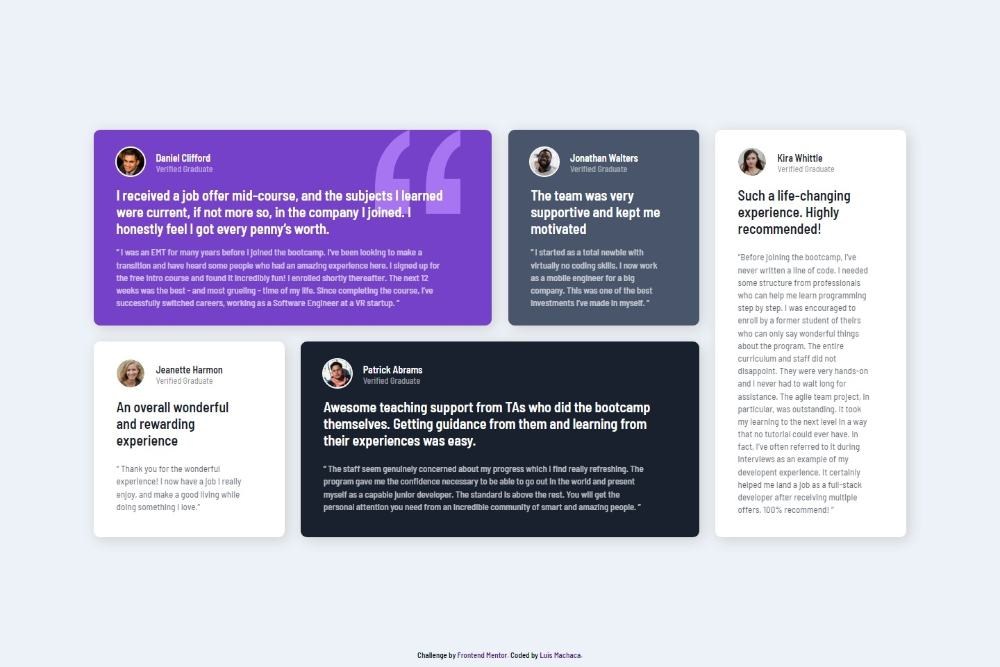

# Frontend Mentor - Testimonials grid section solution

This is a solution to the [Testimonials grid section challenge on Frontend Mentor](https://www.frontendmentor.io/challenges/testimonials-grid-section-Nnw6J7Un7). Frontend Mentor challenges help you improve your coding skills by building realistic projects.

## Table of contents

- [Overview](#overview)
  - [The challenge](#the-challenge)
  - [Screenshot](#screenshot)
  - [Links](#links)
- [My process](#my-process)
  - [Built with](#built-with)
  - [What I learned](#what-i-learned)
  - [Continued development](#continued-development)
  - [Useful resources](#useful-resources)
- [Author](#author)

## Overview

### The challenge

Users should be able to:

- View the optimal layout for the site depending on their device's screen size

### Screenshot

### Links

- Solution URL: [solution](https://your-solution-url.com)
- Live Site URL: [live site](https://your-live-site-url.com)

## My process

### Built with

- Semantic HTML5 markup
- CSS custom properties
- Utility Classes
- Flexbox
- CSS Grid
- Mobile-first workflow
- BEM Methodology

### What I learned

- With the solution of this challenge I was able to consolidate my knowledge in CSS and HTML.

### Continued development

- In the future you could improve and expand this challenge using SASS.It would be a way to consolidate my base knowledge in SASS and take into account good practices  and recommended architecture.

### Useful resources

- [grid-layout](https://developer.mozilla.org/en-US/docs/Web/CSS/CSS_Grid_Layout) - MDN documentation that was useful to me to understand and apply grid to this challenge.

- [calc-css](https://developer.mozilla.org/es/docs/Web/CSS/calc) - This article helped me to know the calc function

- [nth-of-type-css](https://css-tricks.com/almanac/selectors/n/nth-of-type/) - This article helped me to know several uses for nth-of-type in css

- [css-variables](https://www.freecodecamp.org/news/everything-you-need-to-know-about-css-variables-c74d922ea855) - The content of this blog helped me to know other forms of use, that I did not know, about css variables.

## Author

- Linkedin - [luismachaca](https://www.linkedin.com/in/luismachaca)
- Frontend Mentor - [@luismacode](https://www.frontendmentor.io/profile/luismacode)
- Twitter - [@luismacode](https://www.twitter.com/luismacode)
